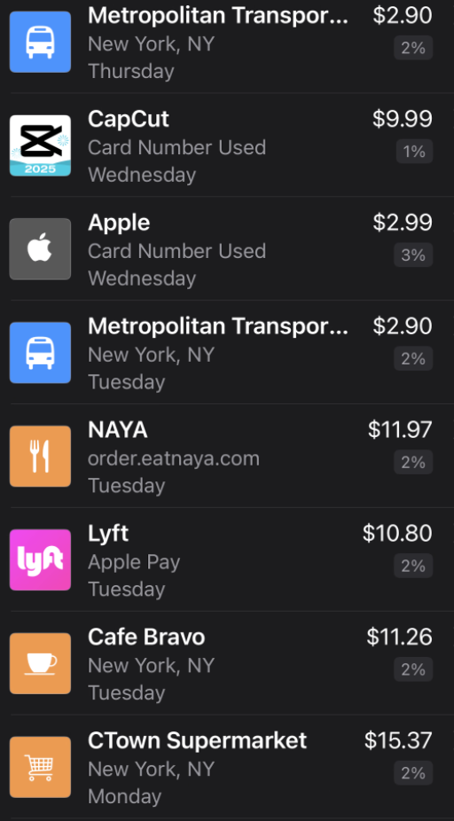

# Apple Card Transaction to CSV Converter

This project was created because **Apple Card does not provide a free way to export transactions daily**.  
With this script, you can **extract transactions from screenshots** and convert them into a structured CSV file.

## 🚀 Features
- Extracts Apple Card transactions from screenshots using **OCR (Tesseract)**.
- Converts extracted text into a **CSV format** for easy financial tracking.
- Allows users to **edit transaction data before saving**.
- Provides a simple **Flask web app** for ease of use.

## 📌 Usage
- Upload an Apple Card transaction screenshot (crop it as shown in the example).
- Click “Convert to CSV” to process the image.
- Edit the extracted transactions in the web UI (if needed).
- Click “Save Changes” and download the CSV file.

## 📝 How It Works
- Uses Tesseract OCR to extract text from uploaded images.
- Parses transaction data, including merchant, date, and amount.
- Displays transactions in an editable table before saving.
- Allows exporting transactions as a CSV file.

## ⚙️ Technologies Used
- Python (Flask, Pandas, OpenCV, Tesseract)
- JavaScript (for table editing & interaction)
- HTML/CSS (for UI)

## 🏗️ Future Improvements
- Add automatic cropping detection.
- Improve OCR accuracy with machine learning.
- Support multiple transaction formats.
  
## 📸 Screenshot Example
To ensure accurate OCR extraction, **screenshots must be cropped properly**.  
Here’s an example of a correctly cropped Apple Card transaction screenshot:



> **Note:** Screenshots should include only the **transaction list**, without extra UI elements.

## 🛠️ Installation
### 1️⃣ Clone the Repository
```bash
git clone YOUR_GITHUB_REPO_URL
cd apple_trans_to_csv

pip install -r requirements.txt

python app.py

The app will run on http://127.0.0.1:5000/.
```


## 📄 License
This project is licensed under the MIT License.
